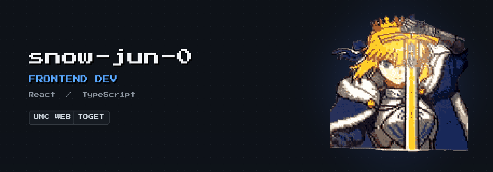
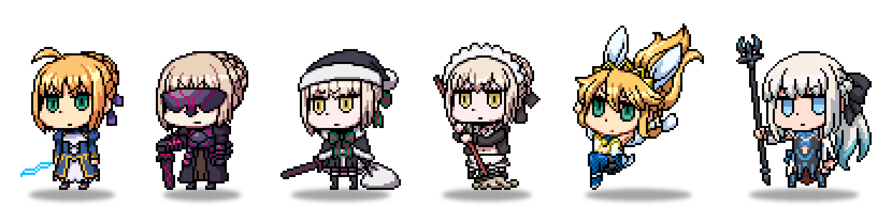
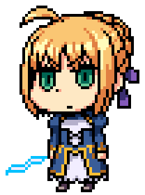
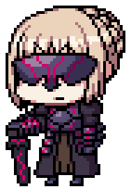
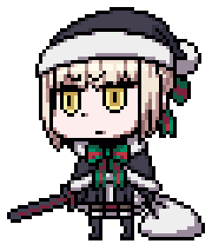
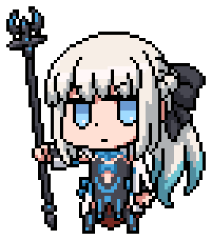

<!-- ===================== HEADER ===================== -->
<div align="center">
  
</div>

<p align="center">
  <a href="https://github.com/snow-jun-0">
    
  </a>
</p>

<!-- ===== SOCIAL BADGES (Fate · navy + gold) ===== -->
<p align="center">
  <a href="https://github.com/snow-jun-0">
    
  </a>&nbsp;
  <a href="https://velog.io/@snow-jun-0/posts">
    
  </a>&nbsp;
  <a href="https://solved.ac/wjo8703/">
    
  </a>&nbsp;
  <a href="mailto:wjo8703@naver.com">
    
  </a>&nbsp;
  
</p>

<!-- ===== SERVANT PARTY (FGO chibi lineup) ===== -->
<div align="center">
  
  <br/>
  <sub>⚔️ my Chaldea party · FGO servant sprites (© TYPE-MOON / FGO — fan use)</sub>
</div>


<!-- ===================== ABOUT ===================== -->
<table>
  <tr>
    <td width="60"></td>
    <td><h2>About Me</h2></td>
  </tr>
</table>

```ts
const junyoung = {
  role: "Frontend Developer",
  university: "동국대학교 컴퓨터공학과 (23학번)",
  focus: ["React", "TypeScript", "사용자에게 실제로 배포되는 화면"],
  currently: "UMC 11기 · Product Engineering(Web) 도전 중",
  motto: "내 화면을 잘 만드는 것과 팀이 멈추지 않게 만드는 건 다른 능력이다",
};
```

- 🧑‍💻 기획서 속 화면이 **실제 배포된 서비스**로 완성되는 전 과정을 좋아합니다.
- 🛡️ **선물 펀딩 웹앱 `투겟(ToGet)`** 에서 프론트엔드 **팀장 겸 개발자**로 팀을 이끌었습니다.
- 🌱 협업 프로세스(Git 컨벤션 · 이슈/PR 규칙 · AI 개발 도구)를 팀에 정착시키는 일에 관심이 많습니다.
- ✍️ 배운 것은 [velog](https://velog.io/@snow-jun-0/posts)에 기록합니다.


<!-- ===================== STACK ===================== -->
<table>
  <tr>
    <td width="60"></td>
    <td><h2>Tech Stack</h2></td>
  </tr>
</table>

<p align="center">
  
  
  
  
  
</p>
<p align="center">
  
  
  
  
  
</p>
<p align="center">
  
  
  
  
  
</p>
<div align="center"><sub>+ REST API · OAuth · Refresh Token</sub></div>


<!-- ===================== PROJECTS ===================== -->
<table>
  <tr>
    <td width="60"></td>
    <td><h2>Projects</h2></td>
  </tr>
</table>

<table>
  <tr>
    <td width="50%" valign="top">
      <h3>⚜️ 투겟 (ToGet)</h3>
      <p><b>함께 만드는 선물 펀딩 웹 서비스</b></p>
      <p>여러 사람이 함께 돈을 모아 하나의 선물을 준비하고,<br/>마음을 담은 후기를 주고받는 웹앱.</p>
      <p>🧑‍✈️ <b>프론트엔드 팀장 겸 개발자</b> · FE 4인 리드<br/>
      🧱 선물 만들기 진입 / 선물 후기 / 마이 선물 목록 구현<br/>
      🚀 React 19 · TS · Vite · Tailwind · TanStack Query</p>
    </td>
    <td width="50%" valign="top">
      <h3>⚜️ UMC (University MakeUs Challenge)</h3>
      <p><b>10기 Web 파트 · 11기 도전 중</b></p>
      <p>React / TypeScript 주간 미션을 수행하며<br/>협업·배포 프로세스를 학습.</p>
      <p>🔁 useQuery · useInfiniteQuery · 최적화 훅<br/>
      🔐 Protected Route · OAuth · Refresh Token<br/>
      🤖 11기부터 생성형 AI를 개발 전 과정에 활용</p>
    </td>
  </tr>
  <tr>
    <td width="50%" valign="top">
      <h3>⚜️ 데일리 플래너 (Daily Planner)</h3>
      <p><b>구글 캘린더·할일과 양방향 동기화되는 개인 플래너 웹앱</b></p>
      <p>가로형 시간표·할 일·D-Day·뽀모도로·습관·통계를<br/>한 화면에서 관리하는 모바일 우선 웹앱.</p>
      <p>🧑‍💻 <b>기획·디자인·개발 전 과정 1인 진행</b><br/>
      🔗 백엔드 없이 Google Calendar/Tasks API 직접 연동<br/>
      🌗 CSS 변수 기반 다크모드 · endTime 기반 타이머<br/>
      🚀 React 18 · TS · Vite · Tailwind · <a href="https://daily-planner-xi-two.vercel.app">Live</a> · <a href="https://github.com/snow-jun-0/daily-planner">Code</a></p>
    </td>
    <td width="50%" valign="top"></td>
  </tr>
</table>


<!-- ===================== STATS ===================== -->
<table>
  <tr>
    <td width="60"></td>
    <td><h2>Stats</h2></td>
  </tr>
</table>

<!-- ===== CONTRIBUTION SNAKE =====
     뱀은 Generate Snake 액션이 output 브랜치에 그려줍니다.
     테마 맞추려면 워크플로우 snake 색을 gold(#E0B84C)·blue(#2E5AAC)로 지정하세요. -->
<div align="center">
  <picture>
    <source media="(prefers-color-scheme: dark)" srcset="https://raw.githubusercontent.com/snow-jun-0/snow-jun-0/output/snake-dark.svg" />
    <source media="(prefers-color-scheme: light)" srcset="https://raw.githubusercontent.com/snow-jun-0/snow-jun-0/output/snake-light.svg" />
    
  </picture>
</div>

<p align="center">
  
  &nbsp;
  
</p>

<div align="center">
  
</div>

<div align="center">
  <a href="https://solved.ac/wjo8703/">
    
  </a>
</div>

<br/>

<div align="center">
  
</div>

<!--
**snow-jun-0/snow-jun-0** is a ✨ _special_ ✨ repository because its `README.md` (this file) appears on your GitHub profile.
-->
